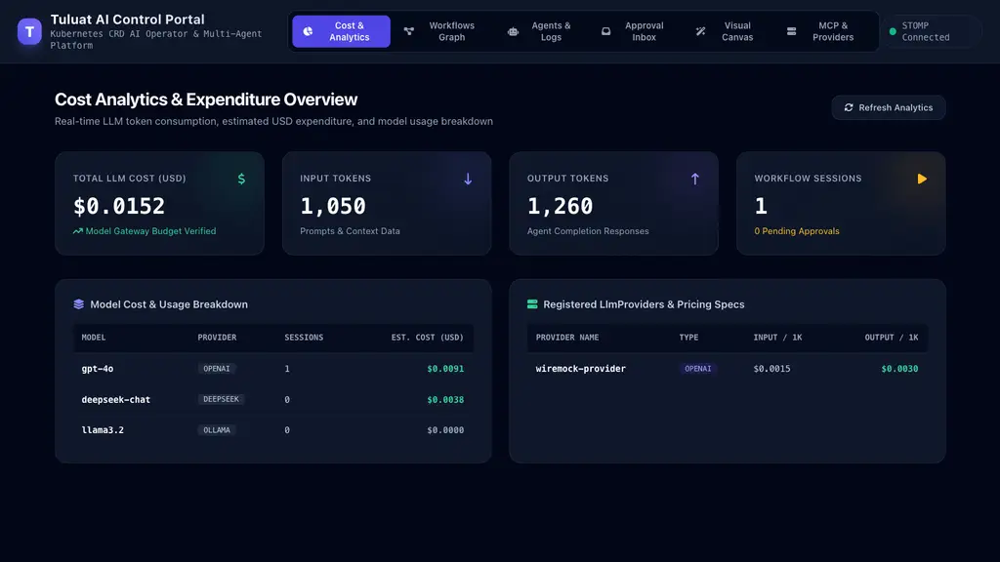
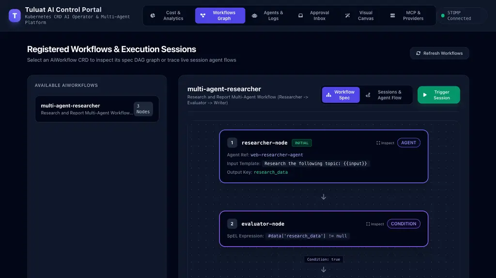
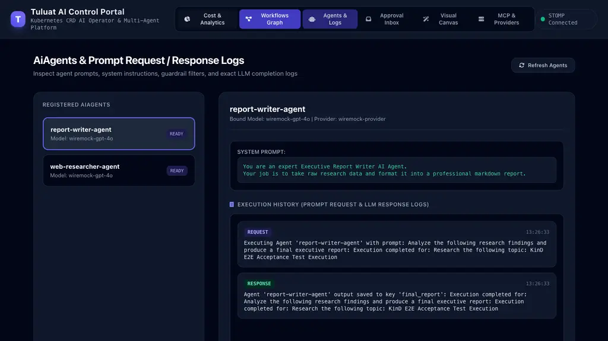
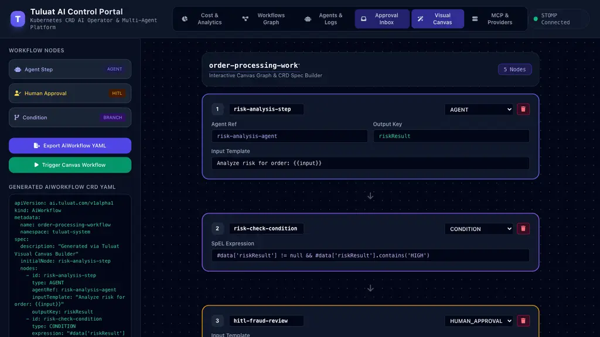
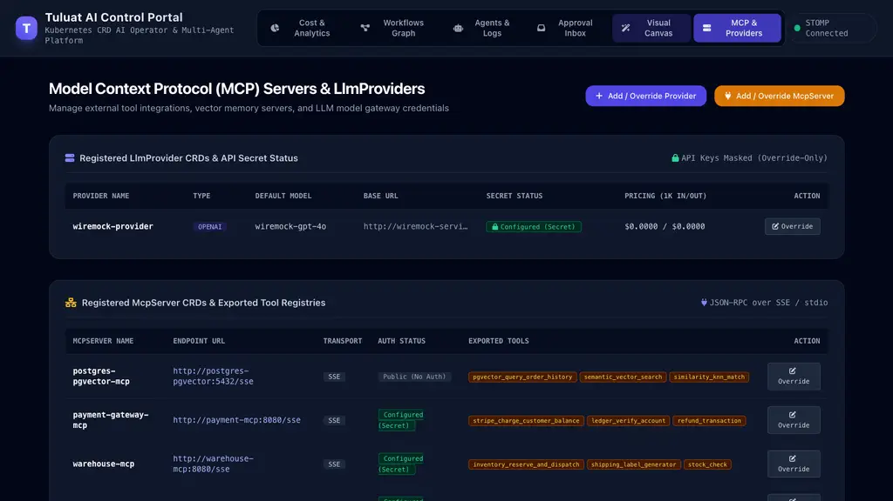

# Kubernetes AI Operator & Workflow Runtime Platform

A Kubernetes-native AI Operator and Orchestration Runtime built with **Java 25 LTS (Virtual Threads)**, **Spring Boot 4.1.0-SNAPSHOT (Spring 7 Framework)**, **Spring AI**, **Temporal SDK**, **Embabel Goal Engine**, and **PostgreSQL + Pgvector**.

---

## 🌟 Key Features

* **Declarative Kubernetes CRDs:** `LlmProvider`, `AiAgent`, `AiWorkflow`, `WorkflowSession`, `McpServer`.
* **Single-Chart Helm Architecture:** Deploy operator, CRDs, PostgreSQL+pgvector, Temporal, MinIO S3, WireMock, Prometheus, and Grafana in one `helm upgrade --install`.
* **Control Portal & Web GUI:** Built-in dashboard (`http://localhost:8089/`) with Cost Analytics, Visual Workflow Builder, Approval Inbox, and Real-time Agent Execution Logs.
* **Hybrid Triggering:** Spawn sessions natively via GitOps (`WorkflowSession` CRD) or REST API (`POST /api/v1/workflows/{name}/sessions`).
* **Durable Execution Engine:** Integrated **Temporal Engine** for crash resilience, non-blocking execution, and human-in-the-loop approvals (`WAITING_APPROVAL`).
* **Safety Guardrails:** Automated PII masking (`EMAIL`, `SSN`, `CREDIT_CARD`, `PHONE`), Prompt Injection defense (`BLOCK` / `SANITIZE`), and Output Validation (`minConfidence`).
* **Model Context Protocol (MCP):** Connect to external tool registries over SSE/stdio (`McpServer` CRD).
* **RAG & S3 Storage:** Chunking (`RecursiveCharacterChunker`), Vector Search (`pgvector` HNSW index), and MinIO S3 Object Storage (`S3ObjectStorage`).
* **Real-time Telemetry:** Prometheus metrics (`/actuator/prometheus`) and execution audit log stream.

---

## 🖥️ Control Portal & Web GUI

The operator includes a built-in single-page Web GUI available at `http://localhost:8089/`:

### 1. Cost Analytics & Expenditure Overview


### 2. Registered Workflows & Execution DAG Graph


### 3. AiAgents & Prompt Execution Logs


### 4. Interactive Visual Canvas & CRD Builder


### 5. Registered McpServer CRDs & Tool Registries


---

## 🚀 Quickstart & Kubernetes Deployment

### 1. Set Up KinD Cluster
```bash
./scripts/create-kind-cluster.sh
```

### 2. Build Docker Image & Deploy via Helm
```bash
# Build fat JAR & Docker image
./mvnw package -DskipTests
docker build -f Dockerfile.local -t tuluat-operator:latest .
kind load docker-image tuluat-operator:latest --name tuluat-cluster

# Deploy full stack via Helm
helm package helm/tuluat-operator -d dist
helm upgrade --install tuluat-operator dist/*.tgz \
  --namespace tuluat-system \
  --create-namespace \
  --set wiremock.enabled=true \
  --set samples.install=true \
  --wait --timeout=5m
```

---

## 🌐 Cluster Access & Port-Forwarding Guide

To access the Control Portal, REST API, and infrastructure dashboards from your host machine:

| Service | Protocol / Port | Port-Forward Command | Access URL / Credentials |
| :--- | :--- | :--- | :--- |
| **Control Portal & REST API** | HTTP 8080 | `kubectl port-forward svc/tuluat-operator-service 8089:8080 -n tuluat-system` | `http://localhost:8089/`<br/>`http://localhost:8089/actuator/health` |
| **Temporal Web UI** | HTTP 8233 | `kubectl port-forward svc/temporal-ui-service 8233:8233 -n tuluat-system` | `http://localhost:8233` |
| **MinIO S3 Object Storage** | HTTP 9000/9001 | `kubectl port-forward svc/minio-service 9000:9000 9001:9001 -n tuluat-system` | API: `http://localhost:9000`<br/>Console: `http://localhost:9001`<br/>*(AccessKey: minioadmin / SecretKey: minioadmin)* |
| **Grafana Dashboard** | HTTP 3000 | `kubectl port-forward svc/grafana-service 3000:3000 -n tuluat-system` | `http://localhost:3000`<br/>*(User: admin / Pass: admin)* |
| **Prometheus Metrics** | HTTP 9090 | `kubectl port-forward svc/prometheus-service 9090:9090 -n tuluat-system` | `http://localhost:9090` |
| **PostgreSQL + Pgvector DB** | TCP 5432 | `kubectl port-forward svc/postgres-service 5432:5432 -n tuluat-system` | `localhost:5432`<br/>*(DB: ai_operator_db, User: postgres, Pass: postgres)* |

---

## 📡 REST API Usage Examples

### 1. Trigger Workflow Session
```bash
curl -X POST http://localhost:8089/api/v1/workflows/multi-agent-researcher/sessions \
  -H "Content-Type: application/json" \
  -d '{
    "input": "Kubernetes CRD Operator Best Practices 2026",
    "maxLoops": 5
  }'
```

### 2. Fetch Session Execution Audit Logs
```bash
curl http://localhost:8089/api/v1/sessions/<SESSION_ID>/logs
```

### 3. Send Human-in-the-Loop Approval Signal
```bash
curl -X POST http://localhost:8089/api/v1/sessions/<SESSION_ID>/approve \
  -H "Content-Type: application/json" \
  -d '{
    "approved": true,
    "feedback": "Great initial research. Please add a security compliance section.",
    "metadata": { "reviewer": "chief-architect@company.com" }
  }'
```

---

## 📚 Documentation Portal (MkDocs)

To launch the interactive documentation portal:

```bash
./scripts/run-docs.sh
```
Open `http://127.0.0.1:8000` in your browser.
