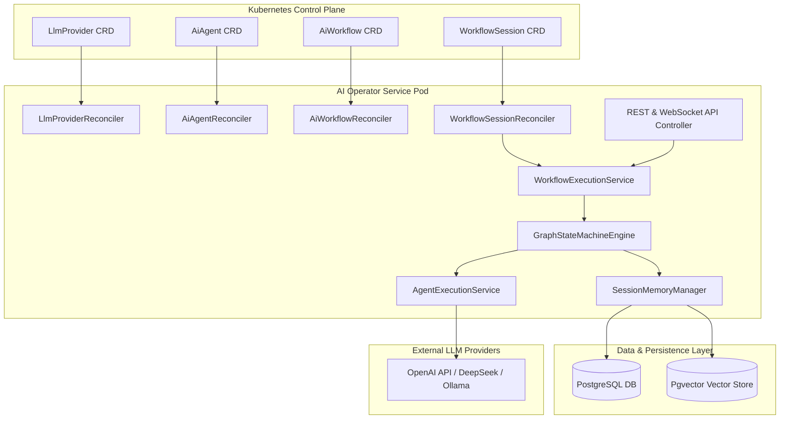
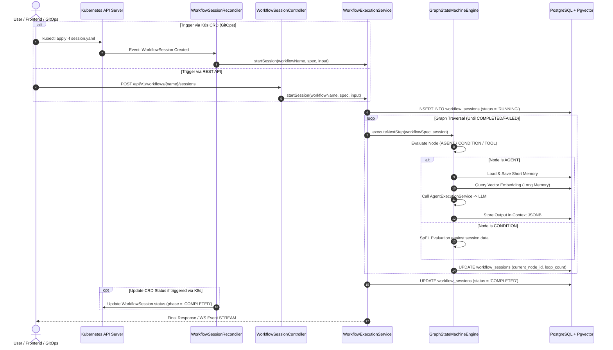
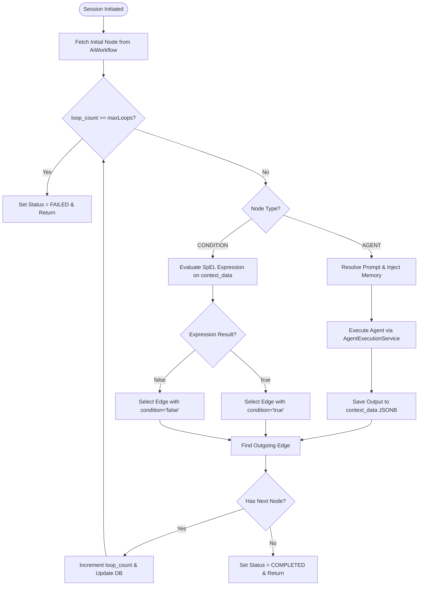
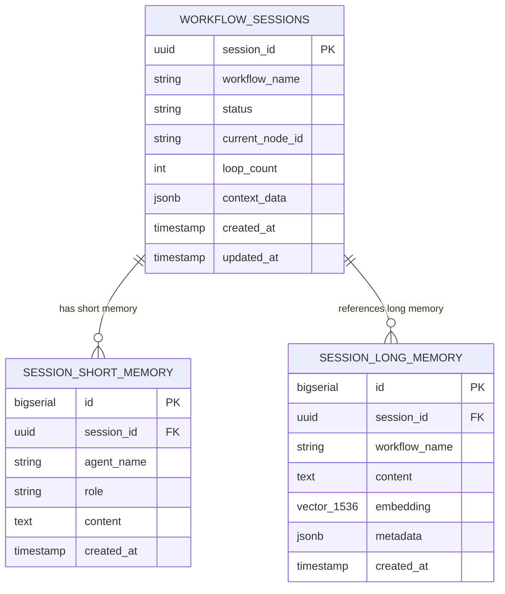

# Kubernetes AI Operator & Workflow Architecture

This document provides a comprehensive technical overview of the **Kubernetes AI Operator & Workflow Engine** architecture, detailing custom resources, graph state machines, hybrid triggering mechanisms, PostgreSQL/Pgvector memory management, and deployment topology.

---

## 1. System Overview & High-Level Architecture

The operator extends Kubernetes with declarative AI resources (`LlmProvider`, `AiAgent`, `AiWorkflow`, `WorkflowSession`). It orchestrates multi-agent workflows using an embedded **Graph State Machine Engine** and persists session states, conversation history, and vector embeddings in PostgreSQL (with `pgvector`).



---

## 2. Custom Resource Definitions (CRDs)

| CRD Kind | ApiVersion | Scope | Description |
| :--- | :--- | :--- | :--- |
| `LlmProvider` | `ai.tuluat.com/v1alpha1` | Namespaced | Configures LLM backend (OpenAI, DeepSeek, Ollama, WireMock) and secret credentials. |
| `AiAgent` | `ai.tuluat.com/v1alpha1` | Namespaced | Defines an AI agent with custom system prompts, model overrides, active skills, guardrails, and Ingress config. |
| `AiWorkflow` | `ai.tuluat.com/v1alpha1` | Namespaced | Declarative graph template containing nodes (`AGENT`, `CONDITION`, `HUMAN_APPROVAL`, `TOOL`), edges, and memory policies. |
| `WorkflowSession` | `ai.tuluat.com/v1alpha1` | Namespaced | Kubernetes-native declarative trigger for executing a workflow session and tracking phase/status. |
| `McpServer` | `ai.tuluat.com/v1alpha1` | Namespaced | Registers external Model Context Protocol (MCP) server endpoints over SSE or stdio. |
---

## 3. Hybrid Triggering & Lifecycle Sequence

Oturumlar (Sessions) hem **Declarative Kubernetes GitOps** (`WorkflowSession` CRD) hem de **Imperative HTTP REST / WebSocket API** üzerinden başlatılabilir.



---

## 4. Graph State Machine & Node Execution Flow

`GraphStateMachineEngine` düğümleri ve kenarları aşağıdaki mantıkla işler:



---

## 5. PostgreSQL + Pgvector Memory Architecture

Memory iki katmandan oluşur:
1. **Short Memory:** Oturum içi konuşma geçmişi (`session_short_memory`).
2. **Long Memory:** `pgvector` uzantısı kullanılarak metin ve semantik vektör araması yapılan ortak veya oturum-bazlı bellek (`session_long_memory`).



---

## 6. Resilience & Pod Crash Recovery

- **Transactional Node State:** Her düğüm geçişinde oturum durumu PostgreSQL veritabanında `@Transactional` olarak güncellenir.
- **Crash Recovery:** Operator pod'u herhangi bir nedenle kapanıp tekrar açıldığında, `workflow_sessions` tablosunda `RUNNING` veya `PENDING` olan oturumlar sorgulanır ve kalınan `current_node_id` üzerinden akış kaldığı yerden devam ettirilir.
- **Loop Guards:** Graf içinde oluşabilecek sonsuz döngülere karşı varsayılan `maxLoops` (örn. 10) kontrolü ile oturum güvenle `FAILED` durumuna çekilir.

---

## 7. Service Connections & Port-Forwarding Guide

The application connects to infrastructure services as follows:
- **PostgreSQL Database (`postgres-service:5432`):** Connected via `spring.datasource.url` for session state, chat history, and vector embeddings.
- **Prometheus Telemetry:** Exposes metrics on `/actuator/prometheus` scraped by Prometheus Server (`prometheus-service:9090`).
- **Temporal Engine (`temporal-service:7233`):** Connected via `spring.temporal.target` for durable execution and human approval signals.

### Port-Forward Commands
```bash
# Control Portal REST API & Telemetry (8089 -> 8080)
kubectl port-forward svc/tuluat-operator-service 8089:8080 -n tuluat-system

# MinIO S3 Object Storage (API: 9000, Console: 9001)
kubectl port-forward svc/minio-service 9000:9000 9001:9001 -n tuluat-system

# Temporal Web UI (8233)
kubectl port-forward svc/temporal-ui-service 8233:8233 -n tuluat-system

# Grafana Dashboard (3000)
kubectl port-forward svc/grafana-service 3000:3000 -n tuluat-system

# Prometheus Metrics Server (9090)
kubectl port-forward svc/prometheus-service 9090:9090 -n tuluat-system

# PostgreSQL + Pgvector Database (5432)
kubectl port-forward svc/postgres-service 5432:5432 -n tuluat-system
```
