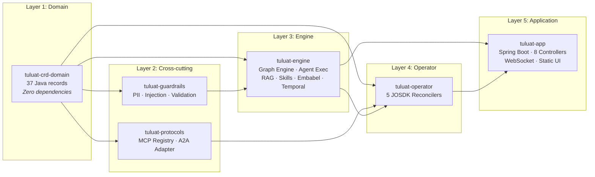

# High-Level Architecture — Tuluat AI Operator (PoC)

> **⚠️ Proof of Concept Notice:** This platform is an early-stage **Proof of Concept**. APIs, CRD schemas, module boundaries, and deployment topologies are subject to change. Production hardening, security audits, and scalability testing have not been performed.

---

## 1. System Context & Overview

Tuluat is a Kubernetes-native AI Runtime and Orchestration Engine (**PoC**). It decouples execution management from underlying LLM providers, providing a unified environment for multi-agent workflows, state management, vector memory, guardrails, and human-in-the-loop control.

```mermaid
graph TB
    subgraph "External Consumers"
        WebPortal["🖥️ Control Portal<br/><i>(Static HTML PoC)</i>"]
        APIClient["REST & WebSocket Clients"]
        K8sGitOps["Kubectl / ArgoCD / GitOps"]
    end

    subgraph "Kubernetes Cluster — tuluat-system"
        subgraph "Operator Pod (Spring Boot 4.1 + Java 25 LTS)"
            direction TB
            API["REST / WebSocket Gateway<br/>8 Controllers"]
            Engine["Graph State Machine Engine<br/>(SpEL, AGENT → CONDITION → TOOL)"]
            AgentExec["Agent Execution Service<br/>(Spring AI, Skills, Guardrails, RAG)"]
            Guardrails["Guardrails Pipeline<br/>(PII Mask → Prompt Injection → Output Validation)"]
            RagService["RAG Service<br/>(Chunk → Embed → Retrieve)"]
            SkillRegistry["Skill Registry<br/>(Calculator, Weather, WebSearch, Custom JARs)"]
            Telemetry["Telemetry Service<br/>(Prometheus /actuator/prometheus)"]
            MCPRegistry["MCP Client Registry<br/>(JSON-RPC over HTTP/SSE)"]
            A2AAdapter["A2A Adapter<br/>(Cross-cluster Agent Discovery)"]
        end

        subgraph "Reconcilers (JOSDK 5.1)"
            direction LR
            RecLP["LlmProvider<br/>Reconciler"]
            RecAgent["AiAgent<br/>Reconciler"]
            RecWF["AiWorkflow<br/>Reconciler"]
            RecSess["WorkflowSession<br/>Reconciler"]
            RecMCP["McpServer<br/>Reconciler"]
        end

        subgraph "CRDs (ai.tuluat.com/v1alpha1)"
            direction LR
            CRD_LP["LlmProvider"]
            CRD_Agent["AiAgent"]
            CRD_WF["AiWorkflow"]
            CRD_Sess["WorkflowSession"]
            CRD_MCP["McpServer"]
        end
    end

    subgraph "Data & Storage Layer"
        Postgres[("PostgreSQL 16<br/>+ pgvector")]
        MinIO[("MinIO / S3<br/>Artifact Store")]
        Prometheus["Prometheus<br/>+ Grafana"]
    end

    subgraph "Durable Execution"
        Temporal["Temporal Server<br/>(Workflow durability)"]
        Embabel["Embabel Goal Engine<br/>(Dynamic action planning)"]
    end

    subgraph "External Ecosystem"
        LLMs["LLM Providers<br/>OpenAI · DeepSeek · Ollama"]
        MCPServers["MCP Servers<br/>PostgreSQL · GitHub · Slack"]
        RemoteAgents["Remote A2A Agents<br/>(Cross-cluster)"]
    end

    %% Trigger paths
    WebPortal --> API
    APIClient --> API
    K8sGitOps --> CRD_Sess
    CRD_Sess --> RecSess

    %% Reconciler → Engine
    RecSess --> Engine
    API --> Engine

    %% Engine internals
    Engine --> AgentExec
    Engine --> Telemetry
    AgentExec --> Guardrails
    AgentExec --> SkillRegistry
    AgentExec --> RagService
    AgentExec --> MCPRegistry
    AgentExec --> A2AAdapter

    %% CRD management
    RecLP --> CRD_LP
    RecAgent --> CRD_Agent
    RecWF --> CRD_WF
    RecMCP --> CRD_MCP
    RecMCP --> MCPRegistry

    %% Execution backends
    AgentExec --> Temporal
    AgentExec --> Embabel
    Engine --> Postgres
    RagService --> Postgres
    RagService --> MinIO

    %% External calls
    AgentExec --> LLMs
    MCPRegistry --> MCPServers
    A2AAdapter --> RemoteAgents

    %% Telemetry
    API --> Prometheus
    Telemetry --> Prometheus
```

---

## 2. Module Dependency Graph (PoC)

---

## 3. Phase Roadmap

| Phase | Status | Deliverables |
|---|---|---|
| **Phase 1** | ✅ Complete | CRDs, Reconcilers, Graph Engine, Temporal, Embabel, CI/KinD E2E |
| **Phase 2** | 🚧 In Progress | Guardrails Pipeline, MCP Client Registry, A2A Adapter, McpServer CRD |
| **Phase 3** | 📋 Planned | React Flow UI, Approval Inbox, Visual Workflow Builder, Helm Chart |

---

## 4. Core Capabilities (PoC)

1. **Declarative Kubernetes CRDs:** Manage LLM Providers, Agents, Workflows, and Sessions natively via Kubernetes manifests.
2. **Hybrid Triggering:** Spawn sessions seamlessly via GitOps (`WorkflowSession` CRD) or HTTP REST/WebSocket API endpoints.
3. **Durable Execution:** Powered by Temporal, ensuring workflows survive pod crashes, restarts, and network disruptions without data loss.
4. **Goal-Oriented Agentic Loops:** Powered by Embabel, allowing agents to dynamically plan actions to reach declarative targets.
5. **Unified Short & Long Memory:** Chat history and semantic vector embeddings (`pgvector`) transactionally saved in PostgreSQL.
6. **Guardrails & Verification:** Automated PII masking, prompt injection defense, and JSON Schema output verification.
7. **Model Context Protocol (MCP):** Connect to external databases, tools, and services via standard MCP servers.
8. **RAG (Retrieval-Augmented Generation):** Chunk → embed → retrieve pipeline with pgvector-backed cosine similarity search.
9. **Observability & Telemetry:** Full Prometheus metric emission (`/actuator/prometheus`) and step-by-step session execution logs.

---

## 5. Component Architecture

### 5.1 Trigger Layer
- **Kubernetes Reconcilers:** `AiWorkflowReconciler` and `WorkflowSessionReconciler` listen for custom resource events in the cluster.
- **REST Controller:** `WorkflowSessionController` exposes POST/GET endpoints for external applications.

### 5.2 Engine & Core Layer
- **`WorkflowExecutionService`:** Manages session initialization, transaction scope, and status transitions.
- **`GraphStateMachineEngine`:** Executes node transitions (`AGENT`, `CONDITION`, `TOOL`), evaluates SpEL expressions, and enforces loop guards.
- **`AgentExecutionService`:** Orchestrates LLM calls with guardrails, skills, RAG context injection, and MCP tool invocation.
- **`WorkflowTelemetryService`:** Emits Prometheus counters and timers for session creations, completions, and node executions.
- **`RagService`:** Orchestrates document ingestion (chunk → embed → store) and retrieval (embed query → cosine similarity → context).

### 5.3 Persistence Layer
- `workflow_sessions`: Runtime session state and context JSONB.
- `session_short_memory`: Conversational message history.
- `session_long_memory`: Pgvector vector embeddings for semantic recall.
- `rag_chunks`: Embedded document chunks with HNSW index for cosine similarity search.
- `workflow_session_logs`: Granular execution audit logs.
