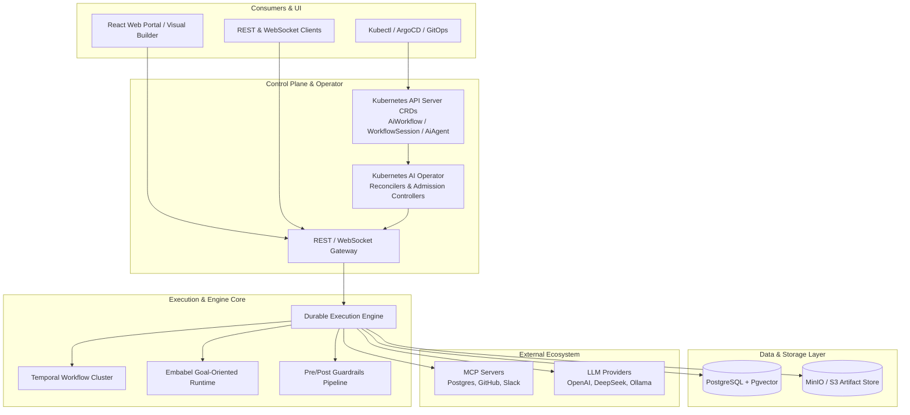

# High-Level Architecture — AI Runtime Platform

This document describes the high-level system boundaries, core capabilities, component topology, and integration points of the **AI Runtime & Operator Platform**.

---

## 1. System Context & Overview

The platform operates as a Kubernetes-native AI Runtime and Orchestration Engine. It decouples execution management from underlying LLM providers, providing a unified environment for multi-agent workflows, state management, vector memory, guardrails, and human-in-the-loop control.

---

## 2. Core Capabilities

1. **Declarative Kubernetes CRDs:** Manage LLM Providers, Agents, Workflows, and Sessions natively via Kubernetes manifests.
2. **Hybrid Triggering:** Spawn sessions seamlessly via GitOps (`WorkflowSession` CRD) or HTTP REST/WebSocket API endpoints.
3. **Durable Execution:** Powered by Temporal, ensuring workflows survive pod crashes, restarts, and network disruptions without data loss.
4. **Goal-Oriented Agentic Loops:** Powered by Embabel, allowing agents to dynamically plan actions to reach declarative targets.
5. **Unified Short & Long Memory:** Chat history and 1536-dimensional semantic vector embeddings (`pgvector`) transactionally saved in PostgreSQL.
6. **Guardrails & Verification:** Automated PII masking, prompt injection defense, and JSON Schema output verification.
7. **Model Context Protocol (MCP):** Connect to external databases, tools, and services via standard MCP servers.
8. **Observability & Telemetry:** Full Prometheus metric emission (`/actuator/prometheus`) and step-by-step session execution logs.

---

## 3. Component Architecture

### 3.1 Trigger Layer
- **Kubernetes Reconcilers:** `AiWorkflowReconciler` and `WorkflowSessionReconciler` listen for custom resource events in the cluster.
- **REST Controller:** `WorkflowSessionController` exposes POST/GET endpoints for external applications.

### 3.2 Engine & Core Layer
- **`WorkflowExecutionService`:** Manages session initialization, transaction scope, and status transitions.
- **`GraphStateMachineEngine`:** Executes node transitions (`AGENT`, `CONDITION`, `TOOL`), evaluates SpEL expressions, and enforces loop guards.
- **`WorkflowTelemetryService`:** Emits Prometheus counters and timers for session creations, completions, and node executions.

### 3.3 Persistence Layer
- `workflow_sessions`: Runtime session state and context JSONB.
- `session_short_memory`: Conversational message history.
- `session_long_memory`: Pgvector vector embeddings for semantic recall.
- `workflow_session_logs`: Granular execution audit logs.
