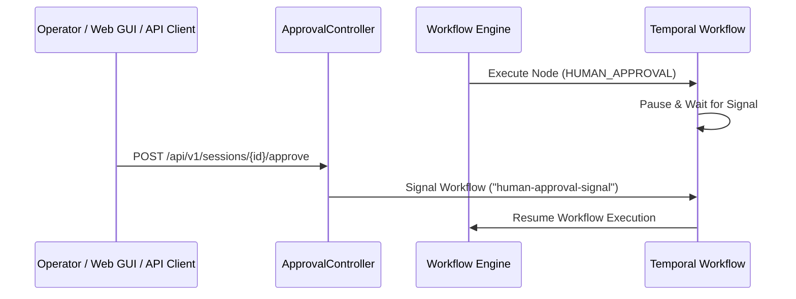

# Human-in-the-Loop (HITL) Approval System

This document details the Human-in-the-Loop approval system, REST endpoints, approval inbox UI integration, and workflow state transitions.

---

## 1. Approval Architecture & Sequence

When an `AiWorkflow` includes a `HUMAN_APPROVAL` node, execution pauses and transitions the `WorkflowSession` to `WAITING_APPROVAL`.



---

## 2. REST Endpoints & Approval Payload

### 2.1 Approve / Reject Session
- **Endpoint**: `POST /api/v1/sessions/{id}/approve`
- **Request Body**:
  ```json
  {
    "approved": true,
    "feedback": "Approved for production rollout",
    "metadata": { "reviewer": "chief-architect@company.com" }
  }
  ```
- **Response**:
  ```json
  {
    "sessionId": "2c1be8a2-150a-4dfe-a9cf-eb85155afa84",
    "status": "SIGNAL_SENT",
    "approved": true
  }
  ```

### 2.2 Pending Approval Inbox List
- **Endpoint**: `GET /api/v1/approvals/pending`
- **Response**: Returns a list of all sessions currently in `WAITING_APPROVAL` status with prompt details, current node, and context payload for reviewer inspection.

---

## 3. Web GUI Approval Inbox

The embedded Control Portal (`http://localhost:8089/`) includes a dedicated **Approval Inbox** tab allowing domain reviewers to:
- Inspect pending approval requests.
- Review upstream agent context data and input templates.
- Provide custom feedback text before approving or rejecting step execution.
