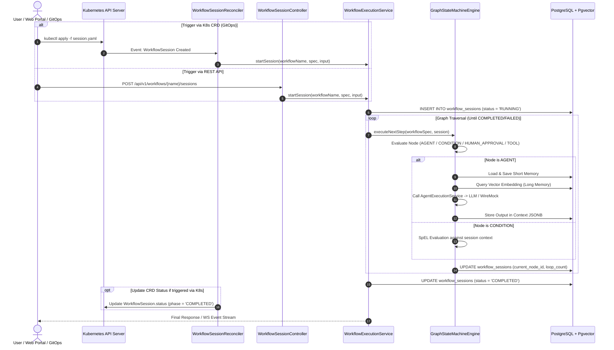
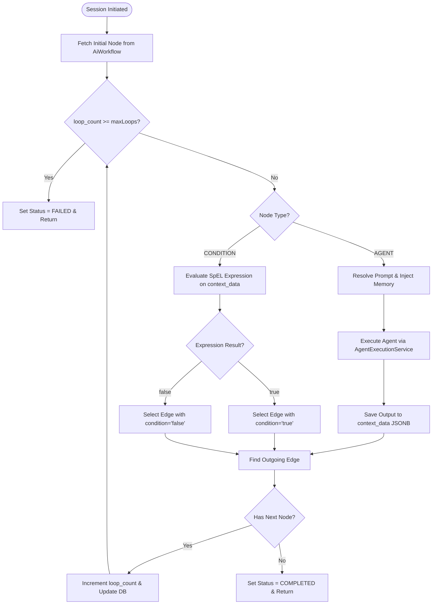

# High-Level Architecture — Tuluat AI Operator

The Tuluat AI Operator is a Kubernetes-native AI Runtime and Orchestration Engine built on **Java 25 LTS (Virtual Threads)** and **Spring Boot 4.1.0-SNAPSHOT (Spring 7 Framework)**. It decouples execution management from underlying LLM providers, providing a unified environment for multi-agent workflows, state management, vector memory, safety guardrails, and human-in-the-loop control.

---

## 1. System Overview & High-Level Architecture

```mermaid
graph TB
    subgraph "External Consumers"
        WebPortal["🖥️ Control Portal Web GUI"]
        APIClient["REST & WebSocket Clients"]
        K8sGitOps["Kubectl / ArgoCD / GitOps"]
    end

    subgraph "Kubernetes Cluster — tuluat-system"
        subgraph "Operator Pod (Spring Boot 4.1 + Java 25 LTS)"
            direction TB
            API["REST / WebSocket Gateway"]
            Engine["Graph State Machine Engine<br/>(SpEL, AGENT → CONDITION → TOOL)"]
            AgentExec["Agent Execution Service<br/>(Spring AI, Skills, Guardrails, RAG)"]
            Guardrails["Guardrails Pipeline<br/>(PII Mask → Prompt Injection → Output Validation)"]
            RagService["RAG Service<br/>(Chunk → Embed → Retrieve)"]
            SkillRegistry["Skill Registry<br/>(Calculator, Weather, WebSearch)"]
            Telemetry["Telemetry Service<br/>(Prometheus /actuator/prometheus)"]
            MCPRegistry["MCP Client Registry<br/>(JSON-RPC over SSE/stdio)"]
            A2AAdapter["A2A Adapter<br/>(Inter-Agent Discovery)"]
        end

        subgraph "Reconcilers (JOSDK 5.1)"
            direction LR
            RecLP["LlmProvider<br/>Reconciler"]
            RecAgent["AiAgent<br/>Reconciler"]
            RecWF["AiWorkflow<br/>Reconciler"]
            RecSess["WorkflowSession<br/>Reconciler"]
            RecMCP["McpServer<br/>Reconciler"]
        end

        subgraph "CRDs (ai.tuluat.com/v1alpha1)"
            direction LR
            CRD_LP["LlmProvider"]
            CRD_Agent["AiAgent"]
            CRD_WF["AiWorkflow"]
            CRD_Sess["WorkflowSession"]
            CRD_MCP["McpServer"]
        end
    end

    subgraph "Data & Storage Layer"
        Postgres[("PostgreSQL 16<br/>+ pgvector")]
        MinIO[("MinIO / S3<br/>Artifact Store")]
        Prometheus["Prometheus<br/>+ Grafana"]
    end

    subgraph "Durable Execution"
        Temporal["Temporal Server<br/>(Workflow durability)"]
        Embabel["Embabel Goal Engine<br/>(Dynamic action planning)"]
    end

    subgraph "External Ecosystem"
        LLMs["LLM Providers<br/>OpenAI · DeepSeek · Ollama · WireMock"]
        MCPServers["MCP Servers<br/>PostgreSQL · GitHub · Custom Tools"]
        RemoteAgents["Remote A2A Agents"]
    end

    %% Trigger paths
    WebPortal --> API
    APIClient --> API
    K8sGitOps --> CRD_Sess
    CRD_Sess --> RecSess

    %% Reconciler → Engine
    RecSess --> Engine
    API --> Engine

    %% Engine internals
    Engine --> AgentExec
    Engine --> Telemetry
    AgentExec --> Guardrails
    AgentExec --> SkillRegistry
    AgentExec --> RagService
    AgentExec --> MCPRegistry
    AgentExec --> A2AAdapter

    %% CRD management
    RecLP --> CRD_LP
    RecAgent --> CRD_Agent
    RecWF --> CRD_WF
    RecMCP --> CRD_MCP
    RecMCP --> MCPRegistry

    %% Execution backends
    AgentExec --> Temporal
    AgentExec --> Embabel
    Engine --> Postgres
    RagService --> Postgres
    RagService --> MinIO

    %% External calls
    AgentExec --> LLMs
    MCPRegistry --> MCPServers
    A2AAdapter --> RemoteAgents

    %% Telemetry
    API --> Prometheus
    Telemetry --> Prometheus
```

---

## 2. Core Platform Capabilities

1. **Declarative Kubernetes CRDs**: Manage LLM Providers, Agents, Workflows, Execution Sessions, and MCP Tool Servers natively via Kubernetes manifests.
2. **Hybrid Triggering**: Spawn sessions seamlessly via GitOps (`WorkflowSession` CRD) or HTTP REST/WebSocket API endpoints.
3. **Durable Execution**: Powered by Temporal SDK, ensuring workflows survive pod crashes, restarts, and network disruptions without state loss.
4. **Goal-Oriented Agentic Loops**: Integrated Embabel Goal Engine allows agents to dynamically plan actions to reach declarative target states.
5. **Unified Short & Long Memory**: Chat history and semantic vector embeddings (`pgvector`) transactionally saved in PostgreSQL.
6. **Safety Guardrails**: Automated PII masking, prompt injection defense, and JSON Schema output verification.
7. **Model Context Protocol (MCP)**: Connect to external databases, tools, and services via standard MCP servers.
8. **RAG (Retrieval-Augmented Generation)**: Chunk → embed → retrieve pipeline with pgvector-backed cosine similarity search and MinIO S3 object storage.
9. **Observability & Telemetry**: Full Prometheus metric emission (`/actuator/prometheus`) and step-by-step session execution audit logs.

---

## 3. Hybrid Triggering & Lifecycle Sequence

Sessions can be initiated via **Declarative Kubernetes GitOps** (`WorkflowSession` CRD) or **Imperative REST API** (`POST /api/v1/workflows/{name}/sessions`):

---

## 4. Graph State Machine DAG Logic

`GraphStateMachineEngine` processes nodes deterministically:

---

## 5. Pod Crash Recovery & Resilience

- **Transactional Node State**: At every DAG node transition, session state is updated in PostgreSQL inside a `@Transactional` block.
- **Crash Recovery**: When an operator pod restarts, any sessions in `RUNNING` status in `workflow_sessions` are queried and resumed from their last saved `current_node_id`.
- **Loop Guards**: Infinite graph loops are prevented by configurable `maxLoops` safety limits (default 10).
