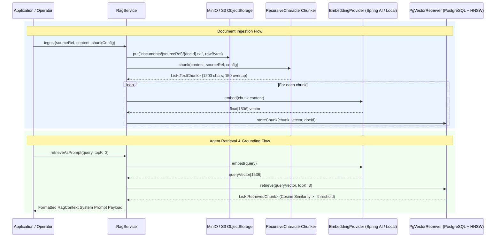

# Retrieval-Augmented Generation (RAG) Architecture

This document details the RAG architecture, chunking pipeline, object storage options (MinIO / S3 vs Local), and vector retrieval mechanisms implemented in `tuluat-engine`.

---

## 1. High-Level RAG Architecture

The RAG subsystem (ADR 008) enhances AI agent prompts with context retrieved from internal domain documents, runbooks, or knowledge bases.



---

## 2. Document Chunking Strategy (`RecursiveCharacterChunker`)

Document text is processed by `RecursiveCharacterChunker` to create retrieval-optimized context windows:

- **Target Chunk Size**: `1200` characters (configurable via `ChunkConfig`).
- **Chunk Overlap**: `150` characters shared between consecutive chunks to prevent semantic boundary loss.
- **Hierarchy of Separators**:
  1. `\n\n` (Paragraph boundaries)
  2. `\n` (Line boundaries)
  3. `. ` (Sentence boundaries)
  4. ` ` (Word boundaries)
  5. Fallback character split if single segment exceeds target size.

---

## 3. Object Storage Options (MinIO / S3 vs Local)

Raw uploaded documents are preserved in binary object storage for auditability and re-indexing.

### 3.1 MinIO / S3 Compatibility (`S3ObjectStorage`)
- **Active when**: `tuluat.rag.storage.type=s3`
- **SDK**: Uses MinIO Java SDK (`io.minio:minio:8.5.12`).
- **Ingestion Pipeline**: When `RagService.ingest("manuals/k8s", text)` is called, the original document is stored in bucket `rag-documents` at `documents/manuals/k8s/{docId}.txt` **and** concurrently chunked & stored in `pgvector`.

### 3.2 Development Filesystem Storage (`LocalObjectStorage`)
- **Active when**: `tuluat.rag.storage.type=local` (default)
- Stores raw files locally under `./data/rag/documents/...` with path traversal protection.

---

## 4. Vector Storage & Search (`PgVectorRetriever`)

Chunks and embeddings are stored in PostgreSQL using the `pgvector` extension:

```sql
CREATE TABLE IF NOT EXISTS rag_chunks (
    id BIGSERIAL PRIMARY KEY,
    doc_id VARCHAR(255) NOT NULL,
    source_ref VARCHAR(512) NOT NULL,
    chunk_index INT NOT NULL,
    content TEXT NOT NULL,
    embedding vector(1536),
    metadata JSONB DEFAULT '{}'::jsonb,
    created_at TIMESTAMP WITH TIME ZONE DEFAULT CURRENT_TIMESTAMP
);

-- Cosine distance indexing via HNSW
CREATE INDEX IF NOT EXISTS idx_rag_chunks_embedding 
ON rag_chunks USING hnsw (embedding vector_cosine_ops);
```

---

## 5. Spring Boot Property Configuration

```yaml
tuluat:
  rag:
    retriever: pgvector        # "memory" (dev/test) or "pgvector" (production)
    embedding: spring-ai       # "local-hash" (testing) or "spring-ai" (OpenAI/Ollama)
    embedding-dimension: 1536
    storage:
      type: s3                 # "local" or "s3"
      local-dir: ./data/rag
      s3:
        endpoint: http://minio-service:9000
        bucket: rag-documents
        access-key: ${MINIO_ACCESS_KEY}
        secret-key: ${MINIO_SECRET_KEY}
```
