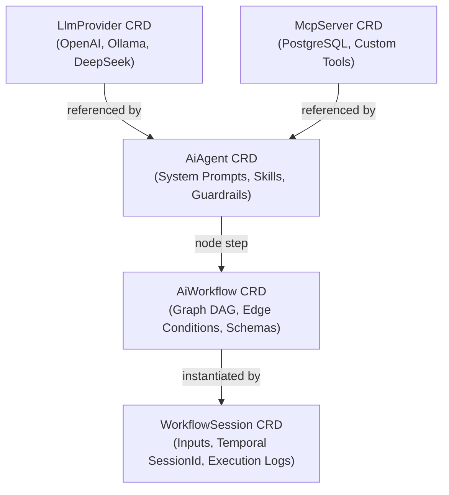

# Kubernetes Custom Resource Definitions (CRDs) & Manifest Guide

Tuluat provides five declarative Kubernetes Custom Resource Definitions (CRDs) in the `ai.tuluat.com/v1alpha1` API group. These CRDs turn AI model providers, agent specifications, multi-agent workflows, execution sessions, and Model Context Protocol (MCP) integrations into native Kubernetes resources managed via GitOps.

---

## Architecture & Resource Hierarchy



---

## 1. LlmProvider (`llmproviders.ai.tuluat.com`)

### Description
Declares downstream AI model endpoints (OpenAI, Ollama, DeepSeek, WireMock, Anthropic), model routing parameters, API keys (via Kubernetes Secrets), token pricing metadata for Model Gateway budget calculations, and fallback chains.

### Specification (`spec`)
| Field | Type | Description |
| :--- | :--- | :--- |
| `providerType` | `string` | Provider implementation (`OPENAI`, `OLLAMA`, `DEEPSEEK`, `WIREMOCK`, `ANTHROPIC`). |
| `baseUrl` | `string` | Base API URL endpoint (e.g., `https://api.openai.com/v1`, `http://ollama-service:11434`). |
| `apiKeySecretRef` | `object` | Reference to a Kubernetes `Secret` containing the API key (`name`, `key`). |
| `defaultModel` | `string` | Default model identifier (e.g., `gpt-4o`, `llama3.2`, `deepseek-r1`). |
| `temperature` | `number` | Sampling temperature (`0.0` to `2.0`). |
| `maxTokens` | `integer` | Maximum output token ceiling per completion request. |
| `costPer1kInputTokens` | `number` | USD cost per 1,000 input tokens (for Model Gateway expenditure tracking). |
| `costPer1kOutputTokens` | `number` | USD cost per 1,000 output tokens. |
| `fallbacks` | `array` | Ordered list of fallback providers (`providerName`, `namespace`, `model`) when primary endpoint fails. |

### Status (`status`)
| Field | Type | Description |
| :--- | :--- | :--- |
| `phase` | `string` | Lifecycle phase (`Ready`, `Reconciling`, `Failed`). |
| `message` | `string` | Status or failure details from reconciliation. |
| `observedGeneration` | `integer` | The generation of the spec last reconciled by the operator. |
| `lastUpdated` | `string` | ISO-8601 timestamp of last reconciliation. |

### Complete Sample Manifest (`config/samples/02_llmprovider_openai.yaml`)
```yaml
apiVersion: ai.tuluat.com/v1alpha1
kind: LlmProvider
metadata:
  name: openai-provider
  namespace: tuluat-system
spec:
  providerType: OPENAI
  baseUrl: https://api.openai.com/v1
  apiKeySecretRef:
    name: openai-secret
    key: api-key
  defaultModel: gpt-4o
  temperature: 0.2
  maxTokens: 4096
  costPer1kInputTokens: 0.0025
  costPer1kOutputTokens: 0.0100
  fallbacks:
    - providerName: ollama-provider
      namespace: tuluat-system
      model: llama3.2
```

---

## 2. AiAgent (`aiagents.ai.tuluat.com`)

### Description
Defines an autonomous AI agent personality, system prompt, tool skills (folder/ConfigMap hot-reloadable), guardrail safety filters (PII masking, prompt injection, output validation), MCP server bindings, and Agent-to-Agent (A2A) inter-agent communication.

### Specification (`spec`)
| Field | Type | Description |
| :--- | :--- | :--- |
| `providerRef` | `object` | Reference to `LlmProvider` resource (`name`, `namespace`). |
| `model` | `string` | Model name override (optional; defaults to provider default model). |
| `systemPrompt` | `string` | System instruction template grounding agent behavior. |
| `userPrompt` | `string` | Default prompt template for single-agent executions. |
| `skills` | `array` | List of enabled capabilities/tools (`name`, `description`, `enabled`, `parameters`). |
| `skillSources` | `array` | Dynamic skill loading configurations (`type`: `FOLDER`/`JAR`/`CONFIGMAP`, `path`, `watch`). |
| `mcpServers` | `array` | Model Context Protocol servers linked to this agent (`name`, `namespace`). |
| `guardrails` | `object` | Safety filters (`piiMasking`, `promptInjection`, `outputValidation`). |
| `a2a` | `object` | Agent-to-Agent communication settings (`enabled`, `remoteDiscovery`). |
| `ingress` | `object` | Optional Kubernetes Ingress configuration for external HTTP/REST access. |

### Status (`status`)
| Field | Type | Description |
| :--- | :--- | :--- |
| `phase` | `string` | Readiness status (`Ready`, `Reconciling`, `Failed`). |
| `effectiveModel` | `string` | Model currently bound and verified for execution. |
| `activeSkills` | `array` | List of successfully loaded skill names. |
| `ingressUrl` | `string` | External Ingress URL if ingress is enabled. |

### Complete Sample Manifest (`config/samples/04_web_researcher_agent.yaml`)
```yaml
apiVersion: ai.tuluat.com/v1alpha1
kind: AiAgent
metadata:
  name: web-researcher-agent
  namespace: tuluat-system
spec:
  providerRef:
    name: openai-provider
    namespace: tuluat-system
  model: gpt-4o
  systemPrompt: |
    You are a meticulous technical researcher. Search for accurate information, 
    synthesize insights, and structure output with concrete references.
  skills:
    - name: web-search
      description: "Search web for recent technical documentation"
      enabled: true
  mcpServers:
    - name: postgres-mcp
      namespace: tuluat-system
  guardrails:
    piiMasking:
      enabled: true
      modes: ["EMAIL", "PHONE", "CREDIT_CARD"]
      replacementToken: "[REDACTED_PII]"
    promptInjection:
      enabled: true
      strategy: BLOCK
    outputValidation:
      enabled: true
      minConfidence: 0.85
```

---

## 3. AiWorkflow (`aiworkflows.ai.tuluat.com`)

### Description
Defines a multi-agent workflow graph (DAG / State Machine) composed of agent execution nodes (`AGENT`), conditional branching nodes (`CONDITION`), external tool steps (`TOOL`), human-in-the-loop validation nodes (`HUMAN_APPROVAL`), and schema-validated step transitions.

### Specification (`spec`)
| Field | Type | Description |
| :--- | :--- | :--- |
| `description` | `string` | High-level summary of the workflow's purpose. |
| `initialNode` | `string` | ID of the entrypoint node. |
| `nodes` | `array` | List of workflow steps (`id`, `type`, `agentRef`, `inputTemplate`, `outputKey`, `expression`, `outputSchema`). |
| `edges` | `array` | Graph transitions (`from`, `to`, `condition`). |
| `memoryConfig` | `object` | Short-term conversation history size & long-term vector memory config (`shortMemorySize`, `enableLongMemory`, `vectorTableName`). |

### Node Types
* `AGENT`: Executes an `AiAgent` with given input template and saves output into workflow state under `outputKey`.
* `CONDITION`: Evaluates SpEL `expression` over workflow memory to choose edge paths.
* `HUMAN_APPROVAL`: Pauses Temporal workflow execution into state `WAITING_APPROVAL` until REST signal `POST /api/v1/sessions/{id}/approve` is received.
* `TOOL`: Executes a direct tool/MCP call.

### Complete Sample Manifest (`config/samples/05_aiworkflow_sample.yaml`)
```yaml
apiVersion: ai.tuluat.com/v1alpha1
kind: AiWorkflow
metadata:
  name: multi-agent-researcher
  namespace: tuluat-system
spec:
  description: "Collaborative research and technical document generation workflow"
  initialNode: research-node
  nodes:
    - id: research-node
      type: AGENT
      agentRef: web-researcher-agent
      inputTemplate: "Research topic: {{input}}"
      outputKey: researchResult
      outputSchema: |
        {
          "$schema": "http://json-schema.org/draft-07/schema#",
          "type": "object",
          "properties": {
            "summary": { "type": "string" },
            "findings": { "type": "array", "items": { "type": "string" } }
          },
          "required": ["summary", "findings"]
        }
    - id: approval-node
      type: HUMAN_APPROVAL
      inputTemplate: "Review research findings before drafting: {{researchResult}}"
      outputKey: approvalFeedback
    - id: write-node
      type: AGENT
      agentRef: report-writer-agent
      inputTemplate: "Draft report from research: {{researchResult}}. User Feedback: {{approvalFeedback}}"
      outputKey: finalReport
  edges:
    - from: research-node
      to: approval-node
    - from: approval-node
      to: write-node
      condition: "approvalStatus == 'APPROVED'"
  memoryConfig:
    shortMemorySize: 10
    enableLongMemory: true
    vectorTableName: workflow_vector_memory
```

---

## 4. WorkflowSession (`workflowsessions.ai.tuluat.com`)

### Description
Represents an active or completed execution instance of an `AiWorkflow`. Created via GitOps manifest apply or dynamically via `POST /api/v1/workflows/{name}/sessions`. Triggers durable Temporal workflow execution.

### Specification (`spec`)
| Field | Type | Description |
| :--- | :--- | :--- |
| `workflowRef` | `string` | Target `AiWorkflow` resource name. |
| `input` | `string` | Initial user query or input text for workflow entry node. |
| `parameters` | `object` | Key-value dictionary of dynamic execution parameters. |

### Status (`status`)
| Field | Type | Description |
| :--- | :--- | :--- |
| `sessionId` | `string` | Unique Temporal Workflow Execution ID (UUID). |
| `phase` | `string` | Execution phase (`PENDING`, `RUNNING`, `WAITING_APPROVAL`, `COMPLETED`, `FAILED`). |
| `currentNode` | `string` | ID of the node currently executing or awaiting approval. |
| `output` | `string` | Final workflow execution result payload. |
| `startTime` | `string` | Session start timestamp. |
| `endTime` | `string` | Session termination timestamp. |

### Complete Sample Manifest (`config/samples/06_workflowsession_sample.yaml`)
```yaml
apiVersion: ai.tuluat.com/v1alpha1
kind: WorkflowSession
metadata:
  name: research-session-001
  namespace: tuluat-system
spec:
  workflowRef: multi-agent-researcher
  input: "Evaluate Kubernetes CRD Operator Best Practices and Java 25 Virtual Threads"
  parameters:
    maxDepth: 3
    priority: "HIGH"
```

---

## 5. McpServer (`mcpservers.ai.tuluat.com`)

### Description
Registers external Model Context Protocol (MCP) tool servers. The operator reconciles `McpServer` CRDs into `McpClientConnection` endpoints registered in `McpClientRegistryImpl`, exposing external databases, APIs, and microservices directly as tools for AI Agents.

### Specification (`spec`)
| Field | Type | Description |
| :--- | :--- | :--- |
| `endpoint` | `string` | URL / socket endpoint of the MCP tool provider. |
| `transport` | `string` | Protocol transport type (`SSE`, `STDIO`, `HTTP`). |
| `authType` | `string` | Authentication mechanism (`NONE`, `API_KEY`, `OAUTH2`). |
| `apiKeySecretRef` | `object` | Kubernetes Secret reference (`name`, `key`) holding authorization credentials. |
| `timeoutSeconds` | `integer` | Request timeout ceiling in seconds. |
| `description` | `string` | Human-readable explanation of capabilities served by this MCP server. |

### Status (`status`)
| Field | Type | Description |
| :--- | :--- | :--- |
| `phase` | `string` | Readiness state (`Ready`, `Reconciling`, `Failed`). |
| `message` | `string` | Health or connection status message. |
| `observedGeneration` | `integer` | Last reconciled generation. |
| `lastUpdated` | `string` | ISO timestamp of last reconciliation. |

### Complete Sample Manifest (`config/samples/07_mcpserver_postgres.yaml`)
```yaml
apiVersion: ai.tuluat.com/v1alpha1
kind: McpServer
metadata:
  name: postgres-mcp
  namespace: tuluat-system
spec:
  endpoint: http://postgres-mcp-service.tuluat-system.svc.cluster.local:8090/mcp
  transport: SSE
  authType: API_KEY
  apiKeySecretRef:
    name: mcp-auth-secret
    key: token
  timeoutSeconds: 30
  description: "Enterprise PostgreSQL schema inspection, SQL query validation, and vector lookup MCP tool server"
```
