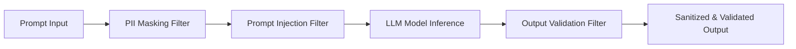

# Safety Guardrails

The **Safety Guardrails** engine (`tuluat-guardrails`) secures both REST API calls and DAG workflow steps with automated input sanitization and output validation.

---

## 1. Guardrail Pipeline (`GuardrailPipeline`)

---

## 2. Guardrail Filters

### 2.1 PII Masking Filter (`PiiMaskingFilter`)
- Automatically detects and replaces sensitive personal data in user prompts before calling LLMs.
- **Modes**: `EMAIL`, `CREDIT_CARD`, `SSN`, `PHONE`.
- **Replacement**: Replaced with customizable tokens (e.g. `[REDACTED]`).

### 2.2 Prompt Injection Filter (`PromptInjectionFilter`)
- Inspects incoming prompts for adversarial jailbreaks, system instruction overrides, and prompt injection attempts.
- **Strategies**:
  - `BLOCK`: Blocks execution and returns `AgentResponse.blocked()`.
  - `SANITIZE`: Strips suspicious instruction phrases.

### 2.3 Output Validation Filter (`OutputValidationFilter`)
- Validates model output against node-declared JSON Schema specifications.
- Assesses confidence score (e.g. `minConfidence: 0.7`) and rejects malformed or unparseable JSON outputs.
