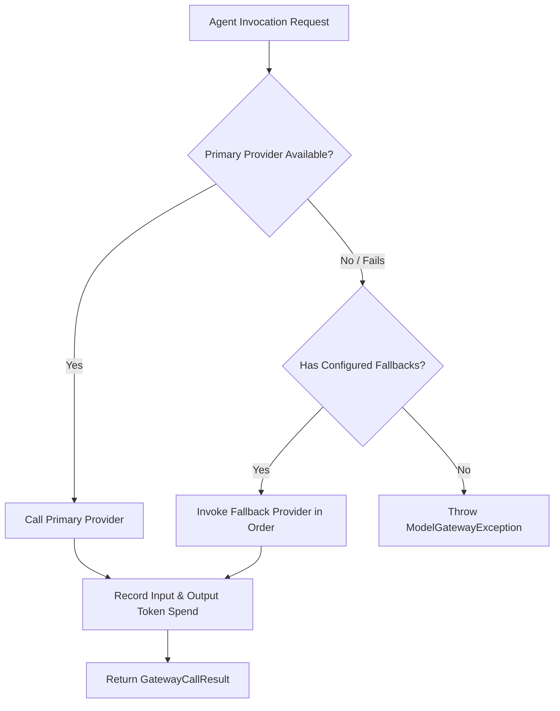

# LLM Provider Management & Routing

The **LLM Provider** feature enables Tuluat to integrate, manage, and dynamically route completion requests across multiple downstream Large Language Model backends.

---

## 1. Supported Providers

| Provider | Type Identifier | Description | Default Model |
| :--- | :--- | :--- | :--- |
| **OpenAI** | `OPENAI` | Direct OpenAI REST API endpoints (`gpt-4o`, `gpt-4o-mini`). | `gpt-4o` |
| **DeepSeek** | `DEEPSEEK` | DeepSeek API endpoints (`deepseek-chat`, `deepseek-r1`). | `deepseek-chat` |
| **Ollama** | `OLLAMA` | Local, zero-cost self-hosted LLM runtime (`llama3.2`, `mistral`). | `llama3.2` |
| **WireMock** | `WIREMOCK` | Deterministic stub server for offline E2E acceptance testing. | `wiremock-gpt-4o` |
| **Anthropic** | `ANTHROPIC` | Anthropic Claude API endpoints (`claude-3-5-sonnet`). | `claude-3-5-sonnet` |

---

## 2. Model Gateway & Fallback Chains (`ModelGateway`)

The `ModelGateway` handles route resolution, fallback execution, and expenditure tracking:



### 2.1 Fallback Specification Example
```yaml
spec:
  providerType: OPENAI
  baseUrl: https://api.openai.com/v1
  defaultModel: gpt-4o
  fallbacks:
    - providerName: deepseek-provider
      namespace: tuluat-system
      model: deepseek-chat
    - providerName: ollama-provider
      namespace: tuluat-system
      model: llama3.2
```

---

## 3. Token Pricing & Expenditure Tracking

Each `LlmProvider` declares input and output token costs:
- `costPer1kInputTokens`: Price in USD per 1,000 prompt tokens.
- `costPer1kOutputTokens`: Price in USD per 1,000 completion tokens.

The operator calculates per-session expenditure and exposes metrics via Prometheus and the Control Portal dashboard.
