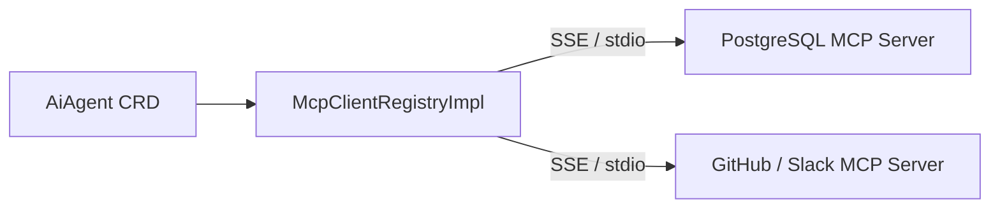

# Model Context Protocol (MCP) & A2A Protocols

This feature covers Model Context Protocol (MCP) external tool integration and Agent-to-Agent (A2A) protocol communication (`tuluat-protocols`).

---

## 1. Model Context Protocol (MCP) Integration

The **Model Context Protocol (MCP)** enables agents to interact with external tools, databases, and microservices exposed by MCP servers (`McpServer` CRD).

### 1.1 `McpServer` CRD Specification
- `endpoint`: Target SSE or HTTP endpoint URL (e.g. `http://postgres-mcp:8080/sse`).
- `transport`: `SSE` or `STDIO`.
- `authType`: `NONE` or `API_KEY` (via Kubernetes Secret reference).

---

## 2. Agent-to-Agent (A2A) Protocol

The **A2A Protocol** enables cross-agent discovery and message passing between autonomous agents:
- **`A2aCard`**: Advertises agent capability manifests (`agentId`, `capabilities`, `inputSchema`, `outputSchema`).
- **`A2aAdapterImpl`**: Relays inter-agent messages and enables asynchronous task delegation across domain-specialist agents.
