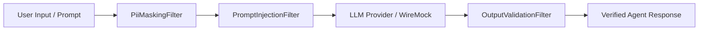

# Phase 2 Features: Safety Guardrails, MCP & A2A Protocols

Phase 2 focuses on safety guarantees, standard tool interoperability via Model Context Protocol (MCP), and direct Agent-to-Agent (A2A) communication.

---

## 1. Safety Guardrails Engine (`tuluat-guardrails`)

The `tuluat-guardrails` module implements input sanitization, threat mitigation, and output verification filters applied before and after LLM inference.

### 1.1 PII Masking Filter (`PiiMaskingFilter`)
- **Modes Supported**: `EMAIL`, `CREDIT_CARD`, `SSN`, `PHONE`
- **Replacement Token**: Customizable per agent (e.g. `[REDACTED]`)
- **Behavior**: Uses regex pattern matching to mask sensitive telemetry or customer data before transmitting prompts to cloud LLM providers.

### 1.2 Prompt Injection Filter (`PromptInjectionFilter`)
- **Strategies**:
  - `BLOCK`: Immediately halts execution and throws `PromptInjectionDetectedException` if injection heuristics (jailbreak phrases, system instruction overrides) match.
  - `SANITIZE`: Strips out malicious payload instructions and allows execution with sanitized text.

### 1.3 Output Validation Filter (`OutputValidationFilter`)
- **Confidence Threshold**: Validates output structure and minimum confidence score (e.g. `minConfidence: 0.7`).
- **Behavior**: Rejects incomplete or low-confidence model responses, signaling retry or fallback execution.

---

## 2. Model Context Protocol (MCP) Client Registry (`tuluat-protocols`)

The MCP registry allows agents to discover and invoke tools exported by external MCP servers (`McpServer` CRD).

### 2.1 Component Specifications
- **`McpServer` CRD**: Defines connection endpoint (`sse` or `stdio`), authentication secret reference, and active tool capabilities.
- **`McpClientRegistryImpl`**:
  - Manages active SSE/stdio transports to registered MCP servers.
  - Discovers tool manifests (`listTools()`) and maps them into Spring AI / Embabel skill definitions.
  - Handles tool invocation (`callTool(serverName, toolName, arguments)`) with error wrapping.

---

## 3. Agent-to-Agent (A2A) Protocol Adapter (`tuluat-protocols`)

The A2A module enables decentralized discovery and communication between autonomous agents running inside or outside the Kubernetes cluster.

### 3.1 A2A Card (`A2aCard`)
- Exports agent metadata: `agentId`, `capabilities`, `inputSchema`, `outputSchema`, `endpointUrl`.
- Allows automatic agent capability matching in multi-agent workflows.

### 3.2 Inter-Agent Message Relay (`A2aAdapterImpl`)
- Relays messages between agents via HTTP/gRPC.
- Supports asynchronous delegation where a leader agent delegates a sub-task to a remote domain-specialist agent.
