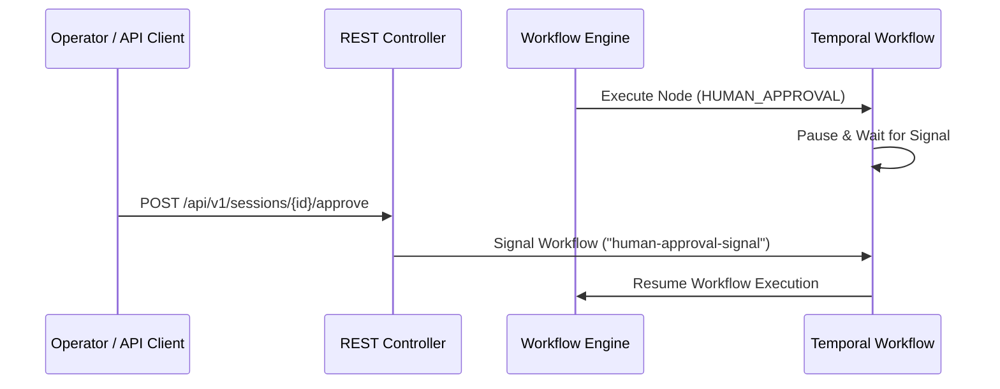

# Phase 3 Features: HITL Approval, Helm Architecture & E2E Testing

Phase 3 introduces Human-in-the-Loop (HITL) approval workflows, single-chart Helm deployment architecture, and automated end-to-end acceptance testing.

---

## 1. Human-in-the-Loop (HITL) Approval Signal System

When an `AiWorkflow` includes a `HUMAN_APPROVAL` node, execution pauses and transitions the `WorkflowSession` to `WAITING_APPROVAL`.



### 1.1 REST Endpoints
- **POST `/api/v1/sessions/{id}/approve`**:
  ```json
  {
    "approved": true,
    "feedback": "Approved for production rollout",
    "metadata": { "approver": "admin@tuluat.com" }
  }
  ```
- **Response**:
  ```json
  {
    "sessionId": "2c1be8a2-150a-4dfe-a9cf-eb85155afa84",
    "status": "SIGNAL_SENT",
    "approved": true
  }
  ```

---

## 2. Helm Deployment Architecture (`helm/tuluat-operator`)

The Helm chart packages the complete operator stack, infrastructure, and optional sample custom resources into a single atomic release.

### 2.1 Chart Directory Structure
```
helm/tuluat-operator/
├── Chart.yaml
├── values.yaml
├── crds/                         # Native Helm CRDs (skipped on upgrade conflicts)
│   ├── aiagents.ai.tuluat.com.yaml
│   ├── aiworkflows.ai.tuluat.com.yaml
│   ├── llmproviders.ai.tuluat.com.yaml
│   ├── mcpservers.ai.tuluat.com.yaml
│   └── workflowsessions.ai.tuluat.com.yaml
└── templates/
    ├── _helpers.tpl
    ├── deployment.yaml           # Operator Deployment + Service
    ├── rbac.yaml                 # ServiceAccount, ClusterRole, ClusterRoleBinding
    ├── infra.yaml                # PostgreSQL, Temporal, WireMock, Prometheus, Grafana
    ├── samples.yaml              # Sample CRs (LlmProvider, AiAgent, AiWorkflow)
    └── namespace.yaml
```

### 2.2 Helm Configuration Flags

| Parameter | Default | Description |
|---|---|---|
| `operator.image.repository` | `tuluat-operator` | Container image repository |
| `operator.image.tag` | `latest` | Container image tag |
| `postgresql.enabled` | `true` | Deploys bundled PostgreSQL+pgvector |
| `temporal.enabled` | `true` | Deploys Temporal Server & UI |
| `wiremock.enabled` | `false` | Deploys WireMock LLM stub (set `true` for E2E) |
| `prometheus.enabled` | `true` | Deploys Prometheus monitoring server |
| `prometheus.serviceMonitor.enabled` | `false` | Enable only if Prometheus Operator CRDs exist |
| `grafana.enabled` | `true` | Deploys Grafana dashboard UI |
| `samples.install` | `false` | Deploys sample LlmProvider, AiAgent, and AiWorkflow |

---

## 3. KinD E2E Acceptance Test Suite

The E2E test suite validates the full stack against a live KinD Kubernetes cluster in CI:

1. **Health Check**: Asserts Spring Boot Actuator `/actuator/health` returns `UP`.
2. **Telemetry Check**: Asserts `/actuator/prometheus` exposes JVM and custom metrics.
3. **CRD Status Check**: Verifies `LlmProvider`, `AiAgent`, and `AiWorkflow` CRs exist and reconcile.
4. **Session Execution**: Triggers `/api/v1/workflows/multi-agent-researcher/sessions` and verifies `COMPLETED` state.
5. **Audit Logs**: Asserts execution log entries are persisted in PostgreSQL.
6. **HITL Signal**: Sends approval payload to `/api/v1/sessions/{id}/approve` and verifies signal receipt.
