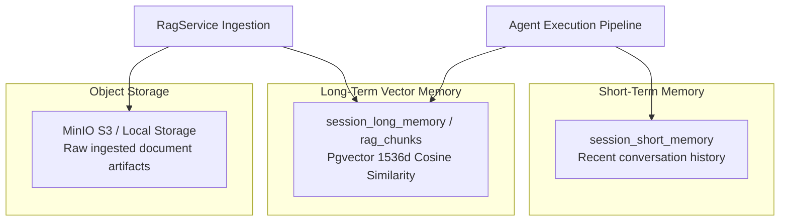

# RAG & Memory Subsystem

This feature covers conversation memory management, vector search with `pgvector`, document chunking, and MinIO S3 object storage.

---

## 1. Dual-Layer Memory Architecture

---

## 2. Conversation Memory (Short Memory)

- Persisted per session in `session_short_memory` PostgreSQL table.
- Stores role-based messages (`user`, `assistant`, `system`) with automatic sliding window truncation (`shortMemorySize`).

---

## 3. Vector Memory & RAG (Long Memory)

- **Document Chunking**: `RecursiveCharacterChunker` splits documents into 1200-character segments with 150-character overlap across semantic boundaries (`\n\n`, `\n`, `.`).
- **Pgvector Indexing**: Chunks and 1536-dimensional embeddings stored in `rag_chunks` table with HNSW cosine similarity index (`vector_cosine_ops`).
- **MinIO S3 Storage**: Uploaded raw document binaries stored in MinIO S3 buckets (`rag-documents`) or local filesystem (`LocalObjectStorage`).
