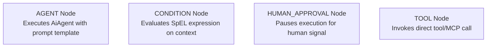

# Workflows & Workflow Sessions

This feature covers declarative multi-agent graph workflows, DAG state machine transitions, and execution sessions.

---

## 1. Declarative Multi-Agent Workflows (`AiWorkflow`)

An `AiWorkflow` defines a Directed Acyclic Graph (DAG) or state machine template composed of nodes and conditional edges.

### 1.1 Node Types



- **`AGENT`**: Executes an `AiAgent` with a prompt template, saving output into workflow memory under `outputKey`.
- **`CONDITION`**: Evaluates a Spring Expression Language (SpEL) expression against workflow context (e.g., `#data['research_data'] != null`).
- **`HUMAN_APPROVAL`**: Transitions session state to `WAITING_APPROVAL` and pauses Temporal execution until a human approval signal is received.
- **`TOOL`**: Directly executes a skill or MCP tool step.

---

## 2. Workflow Sessions (`WorkflowSession` & `WorkflowExecutionService`)

A `WorkflowSession` represents an instance of a workflow execution:
- **GitOps Trigger**: Created declaratively via `WorkflowSession` CRD (`kubectl apply -f session.yaml`).
- **REST API Trigger**: Created imperatively via `POST /api/v1/workflows/{name}/sessions`.

### 2.1 Session Execution Lifecycle

```
PENDING ──► RUNNING ──► WAITING_APPROVAL ──► COMPLETED
               │                                │
               └───────────► FAILED ◄───────────┘
```

- **Loop Guards**: Prevents infinite loops via `maxLoops` parameter (default 10).
- **Session Logs**: Audit entries logged per step in `workflow_session_logs` table.
