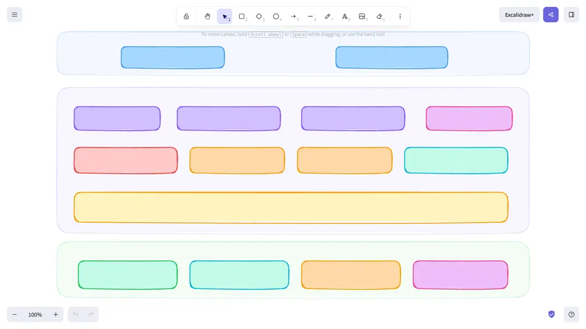
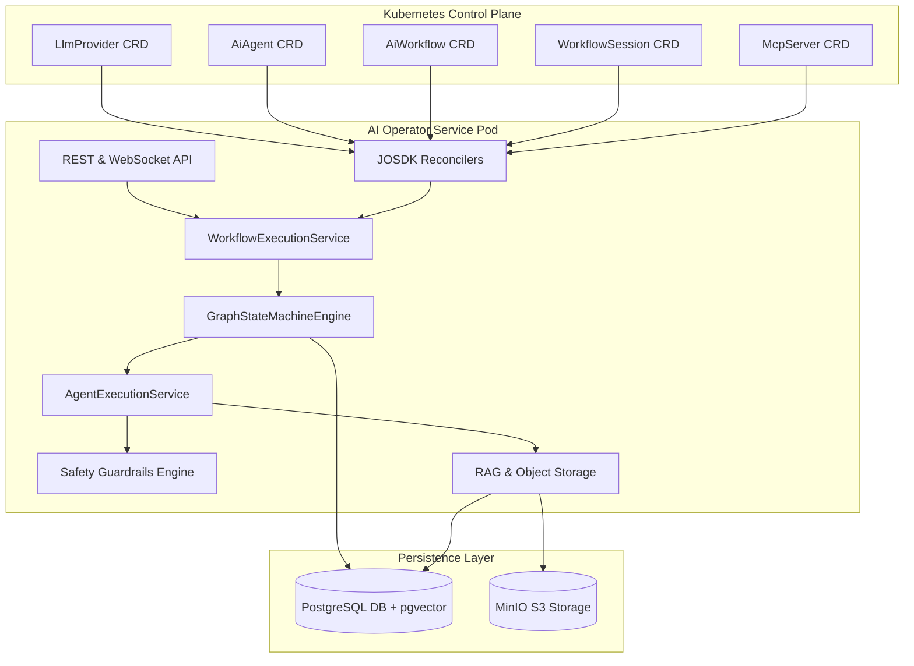

# Kubernetes AI Operator & Workflow Architecture

Welcome to the technical documentation portal for the **Tuluat Kubernetes AI Operator & Workflow Engine**.

---

## 🏛️ System Overview

The operator extends Kubernetes with declarative AI resources (`LlmProvider`, `AiAgent`, `AiWorkflow`, `WorkflowSession`, `McpServer`). It orchestrates multi-agent workflows using an embedded **Graph State Machine Engine** and persists session states, conversation history, and vector embeddings in PostgreSQL (with `pgvector`).

---

## 📚 Documentation Navigation Map

Explore the documentation across core categories:

1. **[Features & Capabilities](features/llm-providers.md)**
   * **[LLM Providers](features/llm-providers.md)**: Provider management, routing, fallbacks, token cost tracking.
   * **[Agents & Skills](features/agents-and-skills.md)**: Autonomous AI agents, prompt templates, dynamic skill registry.
   * **[Workflows & Sessions](features/workflows-and-sessions.md)**: Declarative DAG workflows, state machines, execution sessions.
   * **[Safety Guardrails](features/guardrails.md)**: PII masking, prompt injection defense, JSON schema validation.
   * **[MCP & A2A Protocols](features/mcp-and-a2a.md)**: Model Context Protocol tools and Agent-to-Agent communication.
   * **[RAG & Memory](features/rag-and-memory.md)**: Short/long memory, pgvector similarity search, MinIO S3 storage.

2. **[Architecture](architecture/overview.md)**
   * **[Overview](architecture/overview.md)**: High-level system context, DAG execution, pod crash recovery.
   * **[Low-Level Design](architecture/low-level-design.md)**: Java class models, JPA entities, database schema DDL.
   * **[Safety & Guardrails](architecture/safety-and-guardrails.md)**: PII masking, prompt injection defense, output validation, MCP client registry, A2A protocol.
   * **[HITL Approval System](architecture/hitl-approval-system.md)**: Human-in-the-Loop workflow signals and approval inbox.
   * **[RAG Subsystem](architecture/rag-system.md)**: Document chunking, pgvector search, MinIO S3 object storage.

3. **[Custom Resources (CRDs)](crds/overview.md)**
   * Specifications and complete sample YAML manifests for `LlmProvider`, `AiAgent`, `AiWorkflow`, `WorkflowSession`, and `McpServer`.

4. **[Modules](modules/overview.md)**
   * **[Overview](modules/overview.md)**: 7-module Maven Reactor architecture, step-by-step layer breakdown, responsibilities.
   * **[Dependencies](modules/dependencies.md)**: Inventory of global BOMs and module-by-module Maven dependencies.

5. **[Tests](tests/testing-guide.md)**
   * Unit testing, ArchUnit architecture rules, Spotless/Checkstyle checks, and KinD E2E acceptance test suite.

6. **[Dev Environment](dev-environment/setup.md)**
   * Local setup, KinD cluster creation, Helm deployment, port-forwarding guide, REST API curl examples, Web GUI Control Portal.

7. **[ADRs (Architecture Decision Records)](adrs/001-durable-execution-engine.md)**
   * Design decisions ADR 001 through ADR 011.
