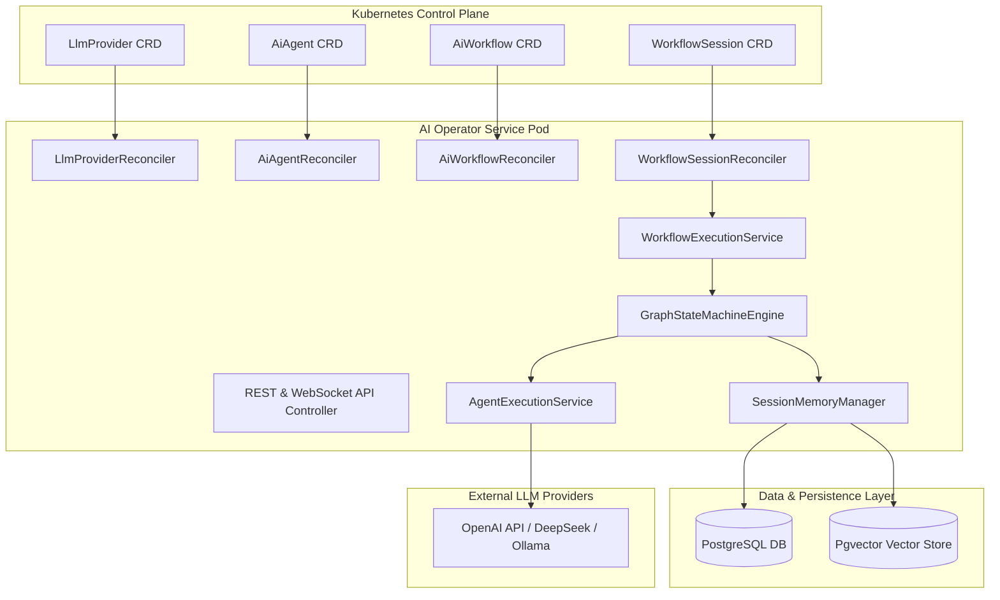

# Kubernetes AI Operator & Workflow Architecture

This document provides a comprehensive technical overview of the **Kubernetes AI Operator & Workflow Engine** architecture, detailing custom resources, graph state machines, hybrid triggering mechanisms, PostgreSQL/Pgvector memory management, and deployment topology.

---

## 1. System Overview & High-Level Architecture

The operator extends Kubernetes with declarative AI resources (`LlmProvider`, `AiAgent`, `AiWorkflow`, `WorkflowSession`). It orchestrates multi-agent workflows using an embedded **Graph State Machine Engine** and persists session states, conversation history, and vector embeddings in PostgreSQL (with `pgvector`).

---

## 2. Core Components & Responsibilities

### 2.1 Reconciler Layer
- **`LlmProviderReconciler`**: Validates API credentials, registers health status, and provisions connection beans.
- **`AiAgentReconciler`**: Resolves LLM provider bindings, validates system prompts, and registers agent specs.
- **`AiWorkflowReconciler`**: Validates DAG topology, ensures initial node exists, and marks workflow as `READY`.
- **`WorkflowSessionReconciler`**: Watches `WorkflowSession` CRs and triggers session execution asynchronously.

### 2.2 Execution Engine
- **`WorkflowExecutionService`**: Manages workflow session lifecycle (`RUNNING`, `COMPLETED`, `WAITING_APPROVAL`, `FAILED`).
- **`GraphStateMachineEngine`**: Evaluates graph nodes (`AGENT`, `CONDITION`, `HUMAN_APPROVAL`, `TOOL`) and SpEL condition expressions.
- **`AgentExecutionService`**: Executes AI Agent prompts using Spring AI, applying guardrails and skills.

---

## 3. Quick Links & Documentation Map

- **[Custom Resource Definitions (CRDs)](crds.md)**: Detailed specification for all 5 Tuluat CRDs.
- **[Maven Dependencies & Architecture](dependencies.md)**: Reactor module structure and dependencies.
- **[High-Level Architecture](architecture/high-level-architecture.md)**: System topology and control loops.
- **[Low-Level Design](architecture/low-level-design.md)**: Code-level class diagrams and state machine details.
- **[Architecture Decision Records (ADRs)](adrs/001-durable-execution-engine.md)**: Key design decisions (ADR 001 to ADR 010).
- **[Feature Matrix & Capabilities](features/overview.md)**: Full breakdown of Phase 1, Phase 2, and Phase 3 capabilities.
  - **[Phase 2 Features](features/phase2-guardrails-mcp-a2a.md)**: Safety Guardrails, Model Context Protocol (MCP), and Agent-to-Agent (A2A) protocol.
  - **[Phase 3 Features](features/phase3-hitl-helm-orchestration.md)**: Human-in-the-Loop (HITL) approval, Helm chart deployment, and KinD E2E testing.
