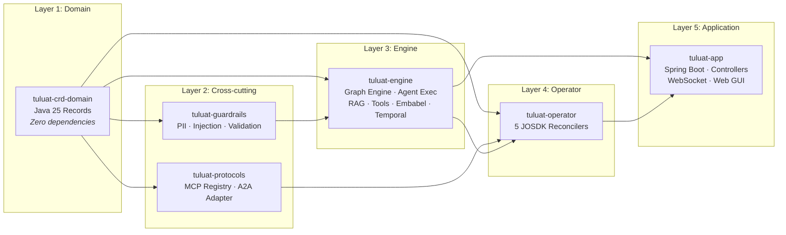

# Maven Multi-Module Architecture

The platform is structured as a decoupled 7-module Maven Reactor project targeting **Java 25 LTS** and **Spring Boot 4.1.0-SNAPSHOT**.

```
tuluat/ (tuluat-parent)
├── tuluat-crd-domain    # Kubernetes CRD Domain Models (Java 25 Records)
├── tuluat-guardrails    # Safety Pipelines (PII, Prompt Injection, JSON Schema)
├── tuluat-protocols     # Integration Protocols (MCP Client Registry, A2A)
├── tuluat-engine        # Core Execution Engine (DAG State Machine, Gateway, RAG)
├── tuluat-operator      # K8s Controllers & Reconcilers (Java Operator SDK)
└── tuluat-app           # Spring Boot Application, REST Controllers & Web GUI
```

---

## 1. Module Dependency Graph



---

## 2. Step-by-Step Module Layering & Responsibilities

1. **`tuluat-parent`** *(Parent POM)*
   * Centralizes dependency management (Spring Boot 4.1, Java 25 LTS, Spring AI, JOSDK 5.1, Fabric8, Temporal), Maven compiler options (`--enable-preview`), plugin configurations (Spotless, Checkstyle, ArchUnit), and reactor build order.

2. **`tuluat-crd-domain`** *(Kubernetes Domain Models)*
   * Houses Fabric8 Kubernetes Custom Resource Definition (CRD) models (`LlmProvider`, `AiAgent`, `AiWorkflow`, `WorkflowSession`, `McpServer`) defined as immutable Java 25 `record` types.
   * Pure data model layer with zero runtime dependencies on Spring Web or execution engines.

3. **`tuluat-guardrails`** *(Safety & Policy Pipeline)*
   * Enforces pre-execution filters (PII masking for `EMAIL`, `CREDIT_CARD`, `SSN`, `PHONE`, prompt injection defense) and post-execution JSON Schema output validation via `json-schema-validator`.
   * Runs independently to secure both REST and DAG workflow execution paths.

4. **`tuluat-protocols`** *(External Tool & Agent Protocols)*
   * Manages the Model Context Protocol (MCP) Client Registry for dynamically connecting agents to external tool servers over SSE/stdio.
   * Defines Agent-to-Agent (A2A) message passing and protocol contracts.

5. **`tuluat-engine`** *(Core Runtime Engine)*
   * The orchestration core containing:
     * **`GraphStateMachineEngine`**: Evaluates SpEL conditions (`#data[...]`), handles state transitions, and steps through workflow DAG nodes.
     * **`AgentExecutionService`**: Executes prompt pipelines, invoking guardrails, active tools, and LLM gateways.
     * **`ModelGateway`**: Routes model calls across providers with fallback chains, cost estimation, and budget limits.
     * **`RagService`**: Manages document chunking, `pgvector` vector storage, and MinIO S3 object storage.
     * **`Temporal Workflows`**: Provides durable, crash-resilient workflow activities and human-in-the-loop approval signaling.

6. **`tuluat-operator`** *(Kubernetes Operator Controllers)*
   * Implemented using Java Operator SDK (JOSDK 5.1).
   * Contains `LlmProviderReconciler`, `AiAgentReconciler`, and `McpServerReconciler` to reconcile cluster Custom Resources into active operator state.

7. **`tuluat-app`** *(Spring Boot Application & Control Portal)*
   * Executable runner module assembling all components into a unified Spring Boot service.
   * Exposes REST endpoints (`/api/v1/workflows`, `/api/v1/sessions`, `/api/v1/agents`), WebSocket/STOMP event streams, Spring Actuator telemetry, and serves the embedded Web GUI dashboard.
